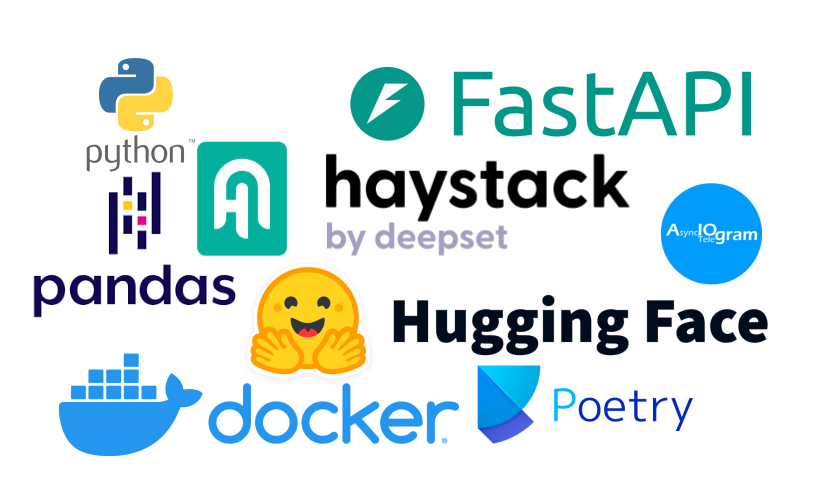

# РЖД: QnA чат-бот на основе базы знаний

[](https://hub.docker.com/r/airndlab/rzd-bot)
[](https://hub.docker.com/r/airndlab/rzd-qna)

## Описание проекта

Проект представляет собой AI-ассистента для сотрудников компании РЖД, который помогает отвечать на вопросы сотрудников касательно социальных льгот и других связанных тем. Ассистент использует искусственный интеллект для обработки вопросов и автоматического формирования ответов, опираясь на данные из базы знаний. 
**Цель проекта** — снижение нагрузки на работников HR-службы, сокращение времени на обработку запросов и повышение точности предоставляемой информации.

## Основные компоненты

Проект состоит из нескольких сервисов, взаимодействующих через сеть:

### 1. **vllm**
- **Задача:** Обработка запросов на основе модели `Qwen2.5-14B-Instruct-GPTQ-Int4`.
- **Технологии:** vllm с поддержкой GPU для быстрой обработки запросов.
- **Детали:**
    - Модель загружается с сервиса Hugging Face.
    - Используется с квантованием GPTQ для повышения производительности на GPU.

### 2. **[Q&A сервис](qna)**
- **Задача:** Обеспечивает обработку вопросов и поиск ответов в базе знаний. Сервис взаимодействует с ботом для предоставления ответа пользователю.
- **Технологии:** Python, FastAPI.
- **Детали:**
    - Хранит и пополняет базу данных вопросов и ответов в формате `SQLite`.
    - Работает с FAQ и профилями пользователей для персонализации ответов.

### 3. **[Telegram бот](bot)**
- **Задача:** Обеспечивает интерфейс общения с пользователями через Telegram.
- **Технологии:** Python, Telegram Bot API.
- **Детали:**
    - Управляет сессиями общения, передавая запросы в сервис QnA и возвращая ответы пользователям.
    - Поддерживает настройки для персонализации сообщений и маршрутизации запросов.

### 4. **Просмотр базы знаний и аналитика**
- **Задача:** Предоставляет интерфейс для аналитики и визуализации данных.
- **Технологии:** Metabase.
- **Детали:**
    - Используется для анализа запросов и улучшения работы ассистента, позволяет HR специалистам изучать статистику обращений.

## Стек технологий
- **Языки программирования:** `Python`, `JavaScript`.
- **Базы данных:** `SQLite`, `Metabase`.
- **RAG-пайплайны:** `Haystack`.
- **Модели ИИ:** `Qwen2.5-14B-Instruct-GPTQ-Int4`.
- **Инфраструктура:** `Docker Compose`
- **Нагрузочное тестирование:** `k6`



## [Нагрузочное тестирование](tests/README.md)

## Установка

Для запуска проекта на локальной машине необходимо:
1. Убедиться, что установлен Docker и docker-compose.
2. Настроить файл `.env` с необходимыми переменными окружения.
3. Выполнить команду:
   ```bash
   docker-compose up
   ```
## Сборка

> Настроена сборка через
> [GitHub Actions](https://github.com/airndlab/hackathon-hacks-ai-rzd-qna/actions/workflows/docker.yml).

```
docker build -t <название вашего образа>:<тег вашего образа> .
```

## [Конфигурация](config/README.md)

## Переменные окружения

- `BOT_TOKEN`: Токен для взаимодействия с Telegram API.
- `QNA_DB_PATH`: Путь к базе данных вопросов и ответов.
- `FAQ_FILE_PATH`: Путь к файлу с часто задаваемыми вопросами (FAQ).
- `MODEL_NAME`: Имя используемой модели ИИ.
- `MODEL_URL`: URL модели для взаимодействия с сервисом.

## Пример использования

1. Пользователь задает вопрос в Telegram через бота.
2. Бот передает вопрос в сервис QnA.
3. QnA отправляет запрос в модель ИИ для формирования ответа.
4. Ответ возвращается в Telegram через бота, с возможностью получения дополнительных деталей.


